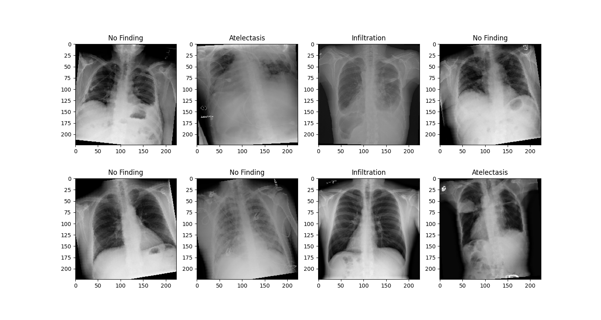

# Lung disease classification with Pytorch

### Dataset & preprocessing

The repository benchmarks various pre-trained models to reveal the best performing model for the task of lung disease classification. The used dataset: ChestX-ray14, which consists of 112k 1024x1024 pixel x-ray images of 14 distinct lung diseases as well as images of healthy individuals. 

In addition, various augmentation methods were added to diversify the dataset.

### What the working system looks like

TBA: GRADIO INTERFACE SCREEN

### Results

|             | DenseNet121 | ResNet50 | EfficientNetv2 |
| ----------- | ----------- | ----------- | ----------- |
| MAE      | None       | None       | None       |
| F1-score | None        | None        | None        |
| Accuracy | None        | None        | None        |

### How to run the project

1. run in the terminal `pip install -r requirements.txt` to download the library requirements.

2. run in terminal `python __main__.py` to download the models with obtianed weights, see the analysis for each model and the framework for each of the models. To re-train the models yourself run the following command in terminal: `python main.py --re_train True`. WARNING: re-training will take significant time and space (60 GB) due to the dataset size.

### System requirements

For using the models without re-training: 1 GB CUDA and 1 minute of execution / no CUDA and 5 minutes of execution.

For using the models with re-training: 10 GB CUDA 
